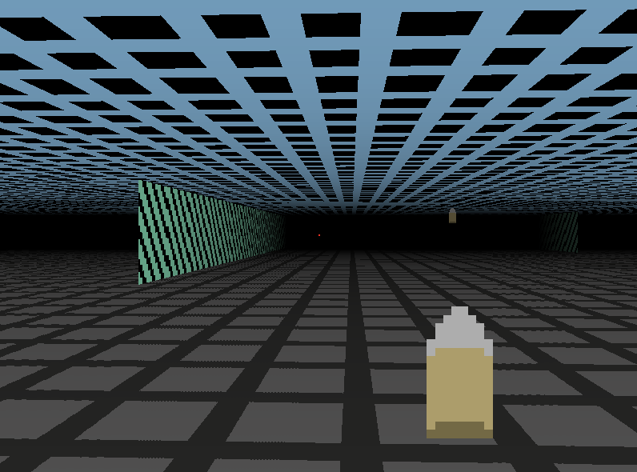

# JS Raycasting experiment

My attempt to create an wolfenstein3d like engine.

[Demo](https://suspicious-wilson-2258ec.netlify.app/)

## Features

- walls rendering,
- fog/shadow effect,
- floor/celing,
- static objects,
- free look

## Screenshoot

